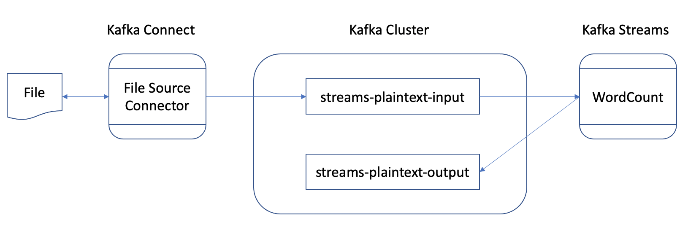

# Getting started with Kafka

Learn how Apache Kafka works and how you can use it to build applications that react to events as they happen. This workshop demonstrates how Kafka can be used as a streaming platform. It covers the basics of Apache Kafka and takes a look at all the components of the Kafka platform, explaining key concepts as we go along.

## Workshop objectives

In this workshop we will build a small event streaming pipeline using the tools and samples built-in Apache Kafka.

Our input data comes from a file. Kafka Connect streams it into a topic in Kafka. Finally Kafka Streams processes the data and writes the output into a new topic.

## [Part 1](./part1/README.md)

The first part gives an overview of the Kafka platform. It covers the main use cases for Kafka. It also contains the prerequisites for the workshop.

## [Part 2](./part2/README.md)

The second part covers the most basic principles of Apache Kafka such as topics, partitions and the Producer and Consumer clients.

## [Part 3](./part3/README.md)

The third part explains how existing systems can be connected to Kafka using Kafka Connect. Using built-in connectors, we will see how data can be imported into Kafka.

## [Part 4](./part4/README.md)

The fourth part introduces Kafka Streams and explains its data processing capabilities. It explores the `WordCountDemo` sample application by running it and detailing its processing logic.
