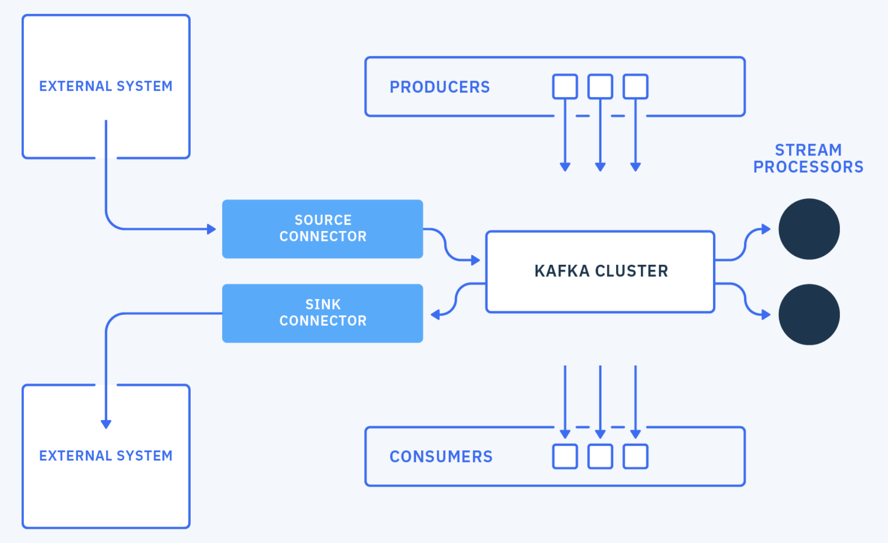

# Part 1 - Setup and Prerequisites

## Kafka overview

[Apache Kafka](https://kafka.apache.org) is a distributed streaming platform. It provides publish-subscribe APIs and can store and process streams of records at large scale.

Kafka is made of the following components:
- Broker: One of more brokers form a Kafka cluster
- Producer: Client to send records into Kafka
- Consumer: Client to read records from Kafka
- Admin: Client to manage Kafka clusters
- Connect: Runtime for Sink and Source Connectors to stream data between external systems and Kafka
- Streams: Library to process streams of records in real time




## Prerequisites

In order to complete this workshop, we need to have the following dependencies installed:

- [Java SDK](https://openjdk.java.net/install/). Version 8 or above
- [gradle](https://gradle.org/install/). Version 6 or above

## Getting Apache Kafka

In this workshop, we will use the Kafka command line tools.

As we will need to edit a sample in [Part 4](../part4/README.md), let's [download](http://kafka.apache.org/downloads) the latest source package from the [Apache Kafka website](http://kafka.apache.org/), uncompress it and compile it. For example, for Kafka 2.6.0:

```sh
> tar -xzf kafka-2.6.0-src.tgz
> cd kafka-2.6.0-src
> gradle
> ./gradlew assemble   # This command takes a few minutes to complete
```

This workshop assumes you are running a Unix based platform like macOS or Linux and will use the scripts from the `bin` directory in the examples. If you are on Windows, use the scripts that are in the `bin/windows` directory.

## Kafka cluster

This workshop requires access to a Kafka cluster. If you don't already have a Kafka cluster, you can use [IBM Event Streams](https://www.ibm.com/cloud/event-streams) or setup a Kafka cluster on your computer.

- If you want to use IBM Event Streams, follow the [Event Streams setup](./event-streams.md) steps.

- If you want to use a local Kafka cluster, follow the [local Kafka setup](./local-kafka.md) steps.


## Next Steps

Continue to [Part 2](../part2/README.md)
